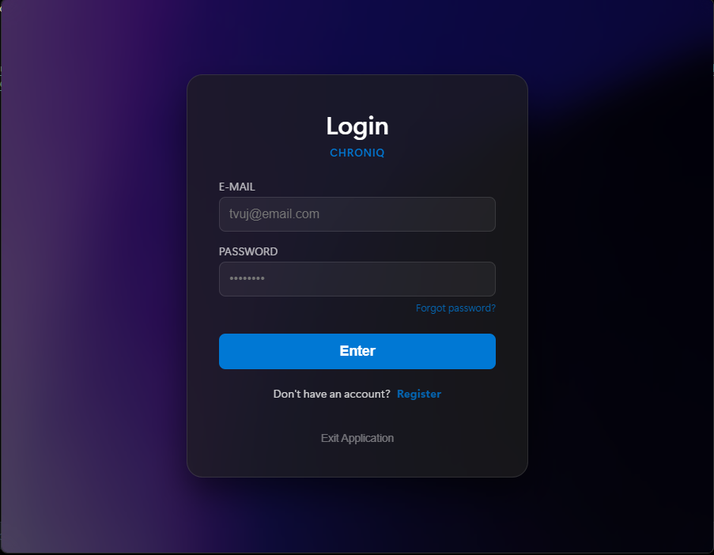
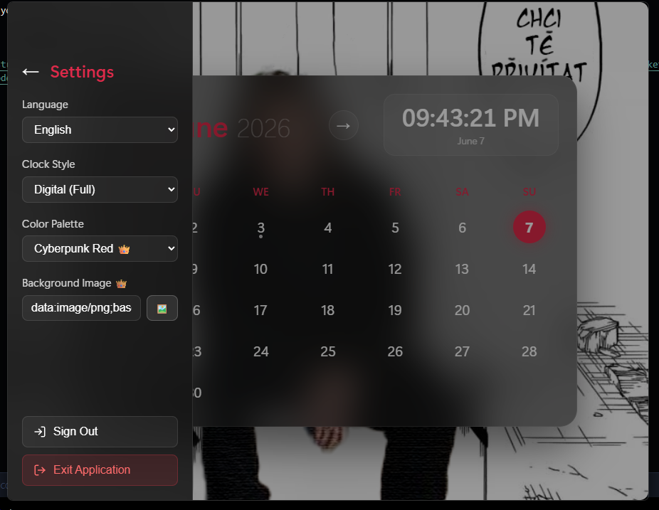

````markdown
# Chroniq 📅

A lightning-fast and minimalist calendar designed for maximum focus and absolute privacy protection. No complicated settings or unnecessary features to distract you—just a clean design and a perfect overview of your time.

## 📱 Screenshots

<div align="center">
  
  
  
</div>

## ✨ Features

* **100% Offline and Secure:** Your events and settings are stored exclusively on your device's local memory. We do not send any data to the cloud.
* **Minimalist Design:** A clean and intuitive user interface with no distractions. Creating a new event is just a matter of a few taps.
* **Lightning Fast:** Built with modern technology and optimized to run incredibly smoothly while saving your device's battery.
* **Completely Ad-Free:** We respect your time and attention. You won't find any annoying banners or pop-ups anywhere in the app.

## 🛠️ Tech Stack

This project is built using:

* [Tauri](https://tauri.app/) - App construction toolkit
* [SvelteKit](https://kit.svelte.dev/) - Web framework
* [Rust](https://www.rust-lang.org/) - Backend language

## 💻 Recommended IDE Setup

[VS Code](https://code.visualstudio.com/) + [Svelte](https://marketplace.visualstudio.com/items?itemName=svelte.svelte-vscode) + [Tauri](https://marketplace.visualstudio.com/items?itemName=tauri-apps.tauri-vscode) + [rust-analyzer](https://marketplace.visualstudio.com/items?itemName=rust-lang.rust-analyzer)

## 🚀 Getting Started

### Prerequisites

Make sure you have Node.js and the Rust toolchain installed on your system.

### Installation

Clone the repository and install dependencies:

```bash
npm install
````

### Development

To start the development server with Hot Module Replacement (HMR):

```bash
npm run tauri dev
```

### Building for Production

To build the final optimized application (APK/AAB for Android):

```bash
npm run tauri build
```

```
```
